# [m3axpi] YOLOv5训练到部署全流程
### 介绍
YOLOv5 是<a href="https://ultralytics.com"> Ultralytics </a>公司于 2020 年 6 月 9 日开源的 2d 实时目标检测算法。涵盖 yolov5n、yolov5n6、yolov5s、yolov5s6、yolov5m、yolov5m6、yolov5l、yolov5l6、yolov5x、yolov5x6 等十几个模型。YOLOv5 具有训练速度快、推理时间短、非常易于训练、方便部署等优点。YOLOv5 的网络结构可以分为intput、backbone、neck、head 四个部分。

本教程讲解 YOLOv5 的模型训练并用 Sipeed 公司的开发板 m3axpi 进行部署，了解产品请看 https://wiki.sipeed.com/m3axpi 。

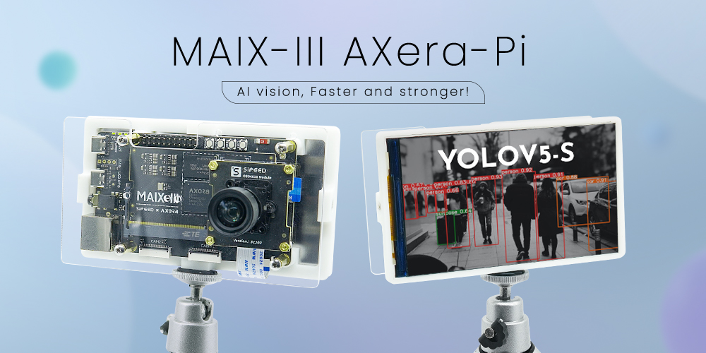

### 开始


首先创建工作目录,以下所有操作均在此目录内。

右键打开终端,执行以下命令:
```bash
cd ~
mkdir m3axpi && cd m3axpi
```


### 一、准备数据集

如何制作目标检测数据集请参考(链接),本教程用标注好的“垃圾检测“数据集对整个流程进行讲解。该数据集可以通过以下三种方式获取:

1.直接下载

Github: https://github.com/Abandon-ht/coco_rubbish_dataset/archive/refs/heads/main.zip

将下载的数据集解压到 datasets 文件夹,并重命名为 rubbish

2.拉取数据集的仓库

```bash
mkdir datasets && cd datasets
git clone https://github.com/Abandon-ht/coco_rubbish_dataset.git rubbish
```

3.终端命令下载

```bash
mkdir datasets && cd datasets
wget https://github.com/Abandon-ht/coco_rubbish_dataset/archive/refs/heads/main.zip
unzip coco_rubbish_dataset-main.zip
mv coco_rubbish_dataset-main rubbish
```

三种方法都可以得到以下 2 个文件夹和 3 个文件


### 二、获取 yolov5 源码

在 m3axpi 目录下(注意不是在 datasets 目录下),拉取 yolov5 源码的仓库

```bash
cd ~/m3axpi
git clone -b v7.0 https://github.com/ultralytics/yolov5.git  # clone
cd yolov5
pip install -r requirements.txt  # install
```


yolov5 目录如图所示:


### 三、训练 yolov5 模型

进入 yolov5 的工作目录, 复制一份 coco.yaml,并重命名为 rubbish.yaml

```bash
cp data/coco.yaml data/rubbish.yaml
```

根据图片修改垃圾分类数据集的路径和类别名字

```bash
# Train/val/test sets as 1) dir: path/to/imgs, 2) file: path/to/imgs.txt, or 3) list: [path/to/imgs1, path/to/imgs2, ..]
path: ../datasets/rubbish  # dataset root dir
train: train2017.txt  # train images (relative to 'path') 118287 images
val: val2017.txt  # val images (relative to 'path') 5000 images
# test: test-dev2017.txt  # 20288 of 40670 images, submit to https://competitions.codalab.org/competitions/20794

# Classes
names:
  0: battery
  1: pills
  2: bananas
  3: apples
  4: cans
  5: bottles
  6: ceram
  7: green vegatable
  8: broccoli
  9: boxes
  10: glass
  11: cigarette
  12: orange
  13: eggshell
  14: spitball
  15: tile
```


修改完成以后,用以下命令开始训练 yolov5s 模型

```bash
python train.py --data data/rubbish.yaml --cfg models/yolov5s.yaml --weights yolov5s.pt --batch-size -1 --epoch 20
```


数据集加载成功,开始训练模型。如果没有加载成功,请检查数据集路径


训练完成后,可以在 ./runs/train/exp/ 文件夹下查看训练的日志

PR_curve.png 为 mAP_0.5 曲线

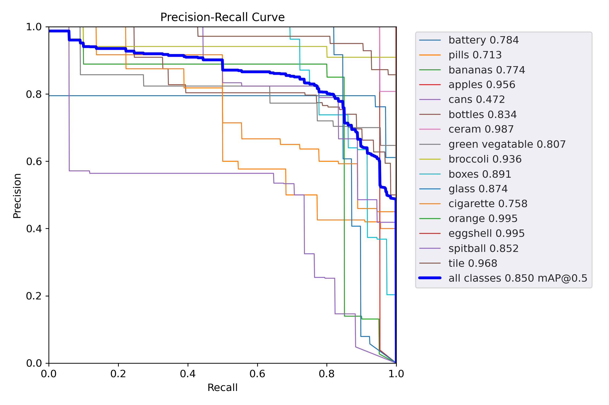

results.png 为全部曲线

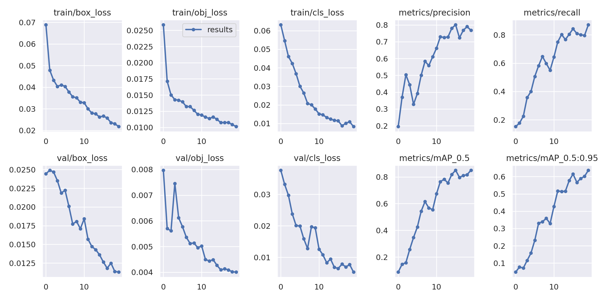

### 四、模型预测和导出

可以使用以下命令预测图片,注意需要将图片和模型的路径修改为自己的路径

```bash
python detect.py --source ../datasets/rubbish/images/IMG_20210311_213716.jpg --weights ./runs/train/exp/weights/best.pt
```


可以在 runs/detect/exp 目录下。看到预测的图片


使用以下命令导出 onnx 模型,注意加上 opset=11 这个参数


```bash
python export.py --include onnx --opset 11 --weights./runs/train/exp/weights/best.pt
```

导出的 onnx 模型在 runs/train/exp/weights 目录下


在浏览器地址栏中输入 netron.app (这个地址),把上一步导出的 best.onnx 文件拖进去,查看 yolov5 的模型结构。

模型的输入名字为:images

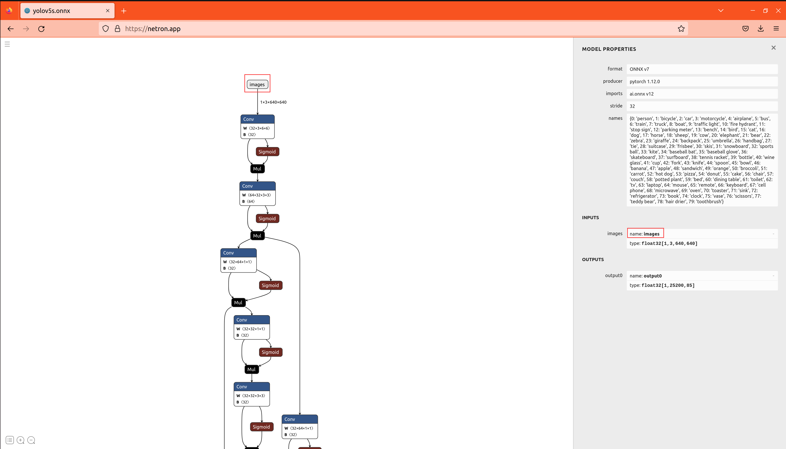

使用 torch1.13.0 之前版本导出的模型,最后的三个卷积(Conv)输出是以 onnx::Reshape_329 结尾。三个卷积(Conv)输出的结尾数字不相同。你导出的模型结尾的数字可能与我的不相同。

第一个 Conv 的输出是 onnx::Reshape_329


第二个 Conv 的输出是 onnx::Reshape_367


第三个 Conv 的输出是 onnx::Reshape_405

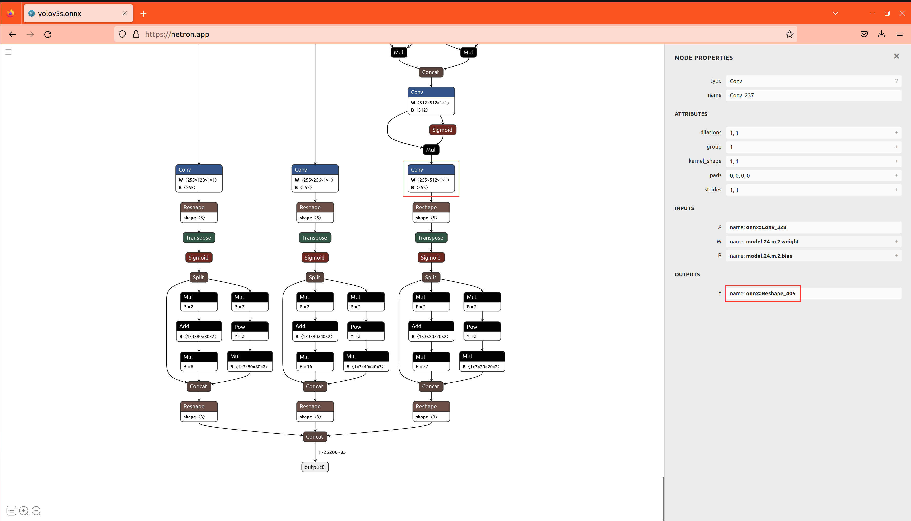

### 五、修改 ONNX 模型

1.脚本修改 ONNX 模型

可以使用以下脚本修改模型,注意如果用 torch1.13.0 及之后版本导出的模型,请使用下面介绍方法2图形化修改模型

```python
import argparse
import onnx

def onnx_sub():
    onnx.utils.extract_model(opt.onnx_input, opt.onnx_output, opt.model_input, opt.model_output)

def parse_opt():
    parser = argparse.ArgumentParser()
    parser.add_argument('--onnx_input', type=str, default='weights/yolov5s.onnx', help='model.onnx path(s)')
    parser.add_argument('--onnx_output', type=str, default='weights/yolov5s_sub.onnx', help='model_sub.onnx path(s)')
    parser.add_argument('--model_input', '--input', nargs='+', type=str, default=["images"], help='input_names')
    parser.add_argument(
        '--model_output', '--output', nargs='+', type=str, default=["onnx::Reshape_329",
                                                                    "onnx::Reshape_367",
                                                                    "onnx::Reshape_405"], help='output_names')
    opt = parser.parse_args()
    return opt

if __name__ == "__main__":
    opt = parse_opt()
    sub = onnx_sub()

```
新建一个名字为 onnxcut.py 的文件,复制以上代码

使用以下命令,注意一定要将模型的三个输出,替换为自己模型最后三个卷积(Conv)的输出

```bash
python onnxcut.py --onnx_input ./runs/train/exp/weights/best.onnx --onnx_output ./runs/train/exp/weights/best_cut.onnx --model_input images --model_output onnx::Reshape_329 onnx::Reshape_367 onnx::Reshape_405
```


修改后的模型如同所示,三个输出分别为 onnx::Reshape_329、onnx::Reshape_367、onnx::Reshape_405


2.图形化修改 ONNX 模型

也可以使用图形化修改模型,使用以下命令拉取源码仓库

```bash
cd ~/m3axpi
git clone https://github.com/ZhangGe6/onnx-modifier.git
```

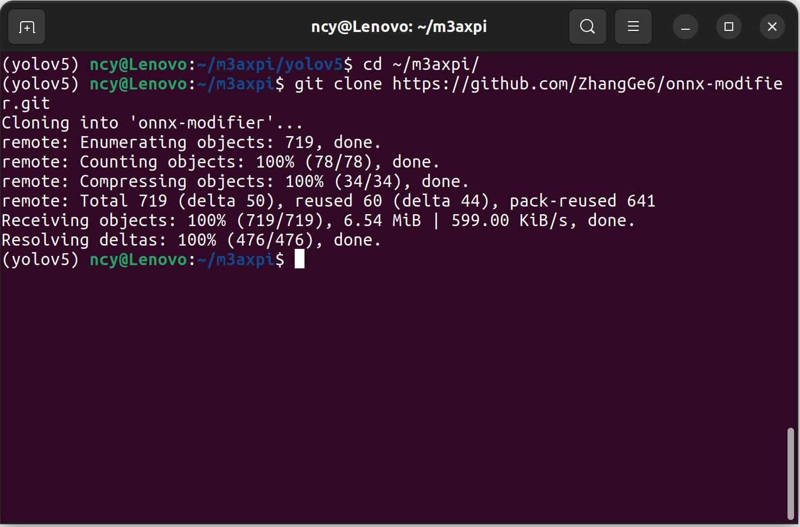

目录如图所示:


进入目录,使用以下命令安装依赖包

```bash
cd onnx-modifier
pip install onnx flask
```
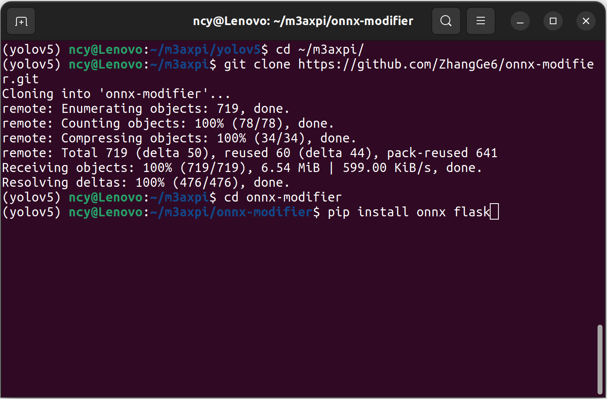

使用以下命令运行脚本
```bash
python app.py
```


在浏览器地址栏输入 http://127.0.0.1:5000 打开网页,把刚才第三步导出的 best.onnx 文件拖进去, 修改模型结构。

依次选中最后三个卷积(Conv)之后的Reshape, 点击 Delete With Children

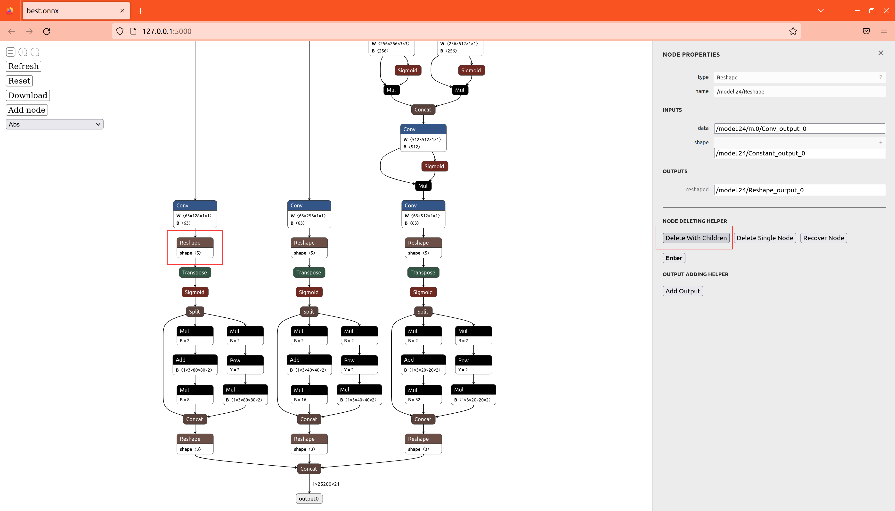

选中第一个删除 Reshape 上方的 Conv,修改 OUTPUTS 的名字为 Conv_output_0,点击 Add Output 添加输出


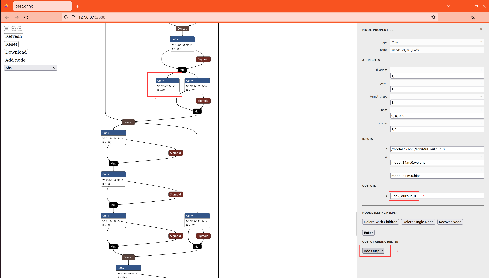

选中第二个 Reshape,点击 Delete With Children


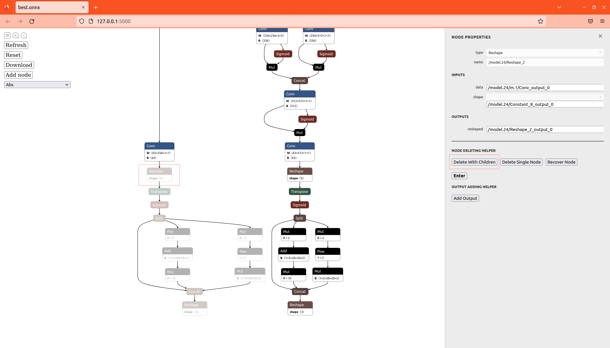

选中第二个删除 Reshape 上方的 Conv,修改 OUTPUTS 的名字为 Conv_output_1, 点击 Add Output 添加输出


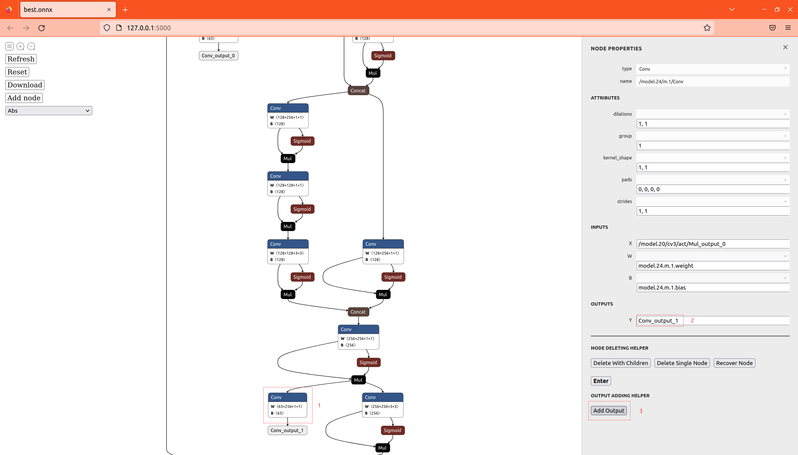

同样选中第三个删除 Reshape上方的 Conv,修改 OUTPUTS 的名字为 Conv_output_2 , 点击 Add Output 添加输出


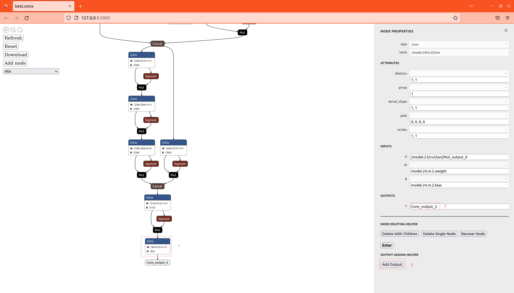

最后点击左上角 Download 下载模型,修改好的模型可以在 modified_onnx 文件夹中找到,修改好的模型名字为 modified_best.onnx


### 六、打包训练图片

进入数据集的图片目录,使用以下命令打包图片为,注意文件的扩展名是 .tar

```bash
cd  ~/m3axpi/datasets/rubbish/images/
tar -cvf rubbish_1000.tar *.jpg
```

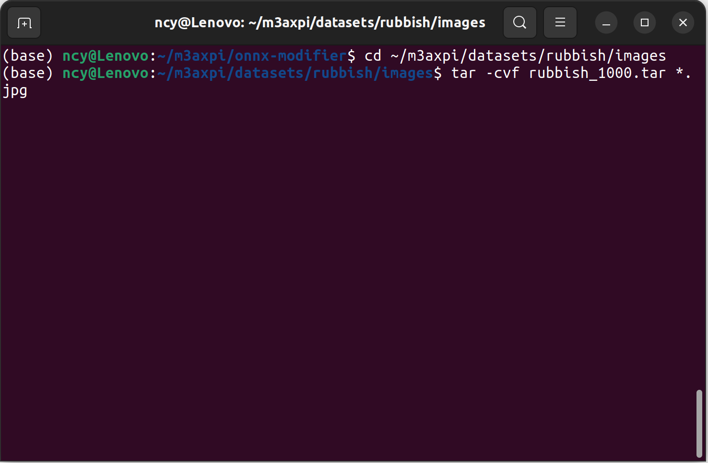

创建 dataset 目录,使用以下命令把压缩包 rubbish_1000.tar 移动到 ~/dataset 目录

```bash
mkdir -p ~/m3axpi/dataset
mv ~/m3axpi/datasets/rubbish/images/rubbish_1000.tar ~/m3axpi/dataset
```


### 搭建模型转换环境

onnx 模型需要转换为 joint 模型才能在 m3axpi 运行,所以需要使用 pulsar 模型转换工具。注意 pb、tflite、weights、paddle 等模型,需要先转换为 onnx 模型才能使用 pulsar 模型转换工具

使用以下命令拉取带有模型转换工具的容器,没有安装docker请自行安装

```bash
docker pull sipeed/pulsar:0.6.1.20
```

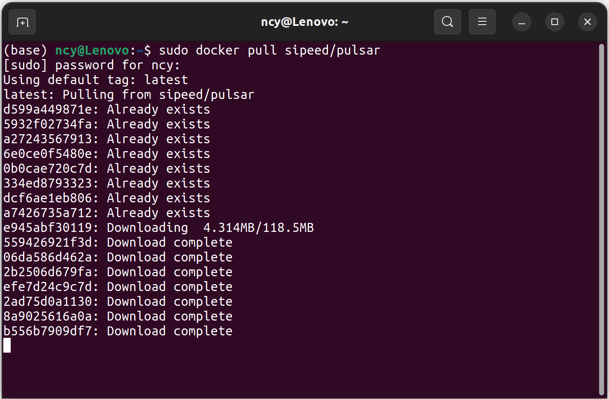

使用以下命令进入容器,如果需要保留该容器,请删除 --rm 这个参数。注意一定要设置共享内存,将 m3axpi 工作目录挂载到容器的 data 目录

```bash
cd ~/m3axpi
docker run -it --net host --rm --shm-size 16g -v $PWD:/data sipeed/pulsar
```


如果有 Nvidia GPU 环境,可以使用以下命令,使用带有GPU的容器,可以加快模型转换的速度

```bash
cd ~/m3axpi
docker run -it --net host --rm --gpus all --shm-size 16g -v $PWD:/data sipeed/pulsar
```


在工作目录下创建 config 和 onnx 文件夹。

```bash
cd ~/m3axpi
mkdir config onnx
```


在 config 下创建一份命名为 yolov5s_rubbish.prototxt 的文件,复制以下内容到文件,注意修改文件中 rubbish_1000.tar 的路径
```
# my_config.prototxt

# 基本配置参数:输入输出
input_type: INPUT_TYPE_ONNX

output_type: OUTPUT_TYPE_JOINT

# 选择硬件平台
target_hardware: TARGET_HARDWARE_AX620

# CPU 后端选择,默认采用 AXE
cpu_backend_settings {
    onnx_setting {
        mode: DISABLED
    }
    axe_setting {
        mode: ENABLED
        axe_param {
            optimize_slim_model: true
        }
    }
}

# input
src_input_tensors {
    color_space: TENSOR_COLOR_SPACE_RGB
}

dst_input_tensors {
    color_space: TENSOR_COLOR_SPACE_RGB
}

# neuwizard 工具的配置参数
neuwizard_conf {
    operator_conf {
        input_conf_items {
            attributes {
                input_modifications {
                    affine_preprocess {
                        slope: 1
                        slope_divisor: 255
                        bias: 0
                    }
                }
                # input_modifications {
                #     input_normalization {
                #         mean: [0,0,0]
                #         std: [0.5,0.5,0.5]
                #     }
                # }
            }
        }
    }
    dataset_conf_calibration {
        path: "/data/dataset/rubbish_1000.tar" # 数据集图片的 tar 包,用于编译过程中对模型校准
        type: DATASET_TYPE_TAR         # 数据集类型:tar 包
        size: 256                      # 编译过程中校准所需要的实际数据个数为 256
    }
    dataset_conf_error_measurement {
        path: "/data/dataset/rubbish_1000.tar" # 用于编译过程中对分
        type: DATASET_TYPE_TAR
        size: 4                        # 对分过程所需实际数据个数为 4
        batch_size: 1
    }

}

dst_output_tensors {
    tensor_layout:NHWC
}

# pulsar compiler 的配置参数
pulsar_conf {
    ax620_virtual_npu: AX620_VIRTUAL_NPU_MODE_111
    batch_size: 1
    debug : false
}
```


移动编辑好的模型文件 best_cut.onnx 或 modified_best.onnx 到 onnx 目录,使用以下命令进行模型转换:(注意修改模型文件的名字改为自己的模型名字)

```bash
pulsar build --input onnx/best_cut.onnx --output yolov5s_rubbish.joint --config config/yolov5s_rubbish.prototxt --output_config yolov5s_rubbish.prototxt
```
开始转换
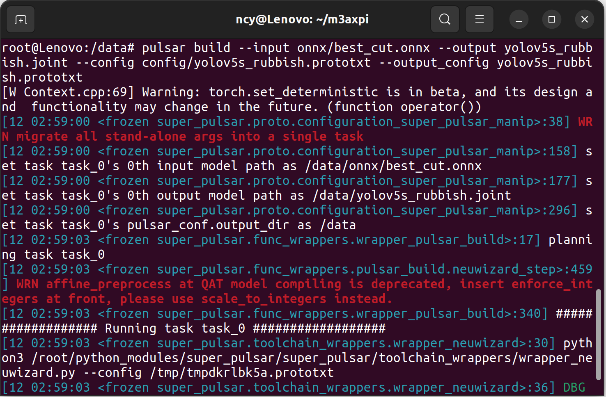

转换时间较长,请耐心等待

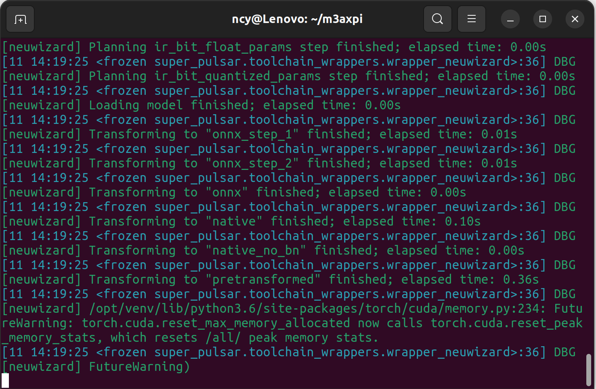

转换完成


可以在工作目录下找到转换后的模型 yolov5s_rubbish.joint


### 部署

请确认经过了训练后拥有以下文件，最起码得得到 `yolov5s_rubbish.joint` 喔。

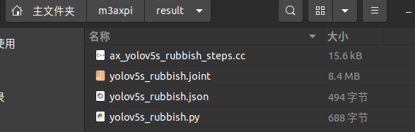

打开 VSCODE 安装 REMOTE SSH 远程开发插件，不了解的看这篇 远程开发初探 - [VSCode Remote Development](https://zhuanlan.zhihu.com/p/82568294)


这里我走的是板子 USB RNDIS 网卡的 IP 地址 root@192.168.233.1 ，不了解的看这篇 [Maix-III AXera-Pi 系统基础使用 - Sipeed Wiki](https://wiki.sipeed.com/hardware/zh/maixIII/ax-pi/basic_usage.html#%E5%9F%BA%E4%BA%8E-ip-%2B-ssh-%E7%99%BB%E5%BD%95)

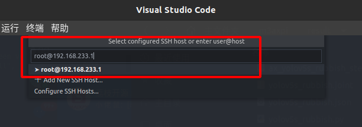

等待登陆成功，如果没有连上请 `ping 192.168.233.1` 并查阅文档解决网络链接问题。

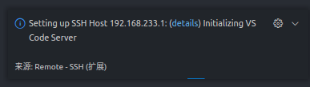

登陆成功，输入默认密码 `root` 即可远程登陆板上系统，就是登陆一台云服务器操作。

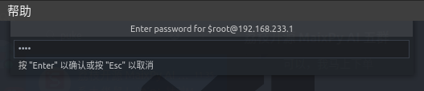

接着，切换一下工作区，这里选根文件系统方便看到系统所有文件。


现在我们把文件都拖拽进板子的 home 目录下，表示这是我们的工作区，如下图。

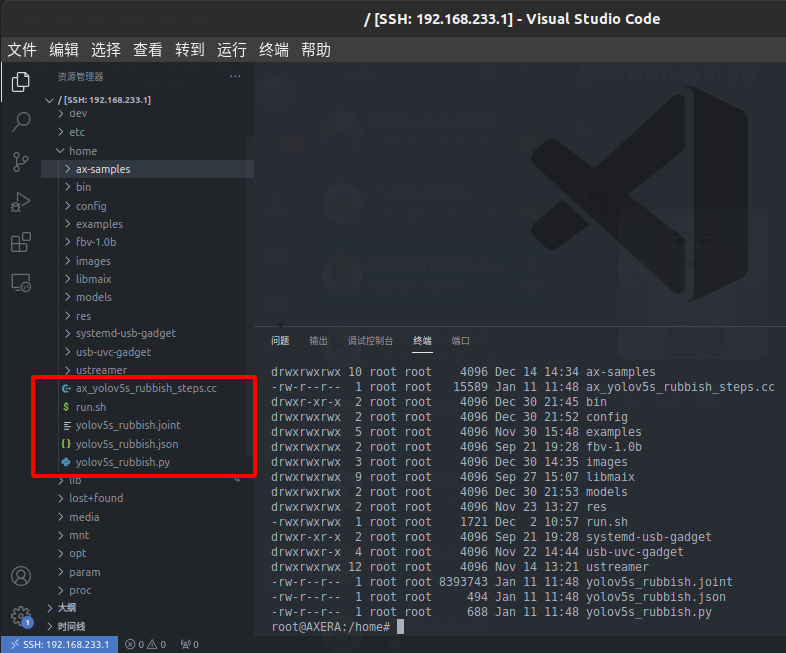

现在我们有两种部署方式，第一种是只验证模型推理一张图片结果，第二种是部署到板子上进行摄像头或网络的实时推理。

## ax-sample

项目主页 https://github.com/AXERA-TECH/ax-samples

这是专门给软件算法工程师推理验证单张图片的部署模型验证的工具，可以在板子的 `home/ax-samples` 找到它，这里我为了举例说明省事一些，采用的是本地编译的方式。


将 `ax_yolov5s_rubbish_steps.cc` 拖拽复制到 `home/ax-samples/examples` 下，并在 `home/ax-samples/examples/CMakeLists.txt` 文件的 `ax620 support` 之下依葫芦画瓢添加 `ax_yolov5s_rubbish` 的编译项，意味着待会就会使用 `ax_yolov5s_rubbish_steps.cc` 编译出可以运行的 ax_yolov5s_rubbish 程序。

```c
if (AXERA_TARGET_CHIP MATCHES "ax620a")   # ax620 support
    axera_example (ax_yolov5s_rubbish        ax_yolov5s_rubbish_steps.cc)
    axera_example (ax_classification        ax_classification_steps.cc)
```

然后终端 `cd build` ，并输入 `make` 即可开始编译，需要注意的是这里系统里已经预编译过了，并配置好环境，如果你想交叉编译，请自行配置了解环境搭建后自行配置，在这里只是为了验证和调试。


稍等一下会出现编译通过，程序放在 `examples/ax_yolov5s_rubbish` 等待运行。


编译完成后，我们看过一下改动的地方，例如 `ax_yolov5s_rubbish_steps.cc` 的主要内容如下：

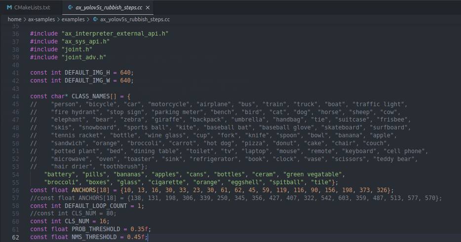

可见它是由 `home/ax-samples/examples/ax_yolov5s_steps.cc` 修改而来，主要就是类别和 ANCHORS 上的改动，所以使用它就可以推理一张图片给我们的板子。
这里我从网上随便找了一张图像，随便拿个常见的电池垃圾。

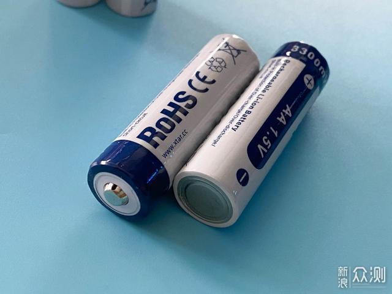

把它保存成 `battery.jpg` 放到 `/home/ax-samples/build/examples/battery.jpg` 即可。

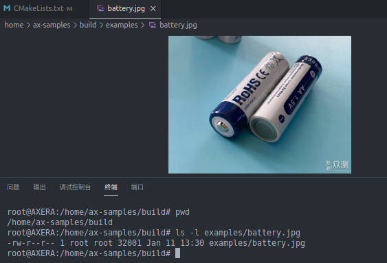

接着我们使用这一张图片进行推理，根据 `examples/ax_yolov5s_rubbish -h` 可知使用方法，使用 `examples/ax_yolov5s_rubbish -m /home/yolov5s_rubbish.joint -i examples/battery.jpg -g 640,640 -r 2 `  运行两次推理测试，它会在输出一个 `home/ax-samples/build/yolov5s_out.jpg` 运行结果，方便你分析后处理的推理结果。


这里附图说明一下单张推理的识别结果。


可以见到已经能够识别目标，这一切工作顺利，接下来要对其进行实时部署推流。

## ax-pipeline

项目主页 https://github.com/AXERA-TECH/ax-pipeline

该项目基于 AXera-Pi 展示 ISP、图像处理、NPU、编码、显示 等功能模块软件调用方法，方便社区开发者进行快速评估和二次开发自己的多媒体应用，由于 ax-pipeline 已经适配好 yolov5s 模型了，所以只需要配置一下代码就可以使用 python3 代码进行调试。

更多请参考 [Maix-III AXera-Pi 试试 Python 编程 - Sipeed Wiki](https://wiki.sipeed.com/hardware/zh/maixIII/ax-pi/python_api.html)

确认板上的 `/home/yolov5s_rubbish.json` 配置，确认 `/home/yolov5s_rubbish.joint` 模型文件。

```json
{
    "MODEL_TYPE": "MT_DET_YOLOV5",
    "MODEL_PATH": "/home/yolov5s_rubbish.joint",
    "ANCHORS": [
        10, 13, 16, 30, 33, 23, 30, 61, 62, 45, 59, 119, 116, 90, 156, 198, 373, 326
    ],
    "CLASS_NAMES": [
        "battery", "pills", "bananas", "apples", "cans", "bottles", "ceram", "green vegatable",
        "broccoli", "boxes", "glass", "cigarette", "orange", "eggshell", "spitball", "tile"
    ],
    "CLASS_NUM": 16,
    "NMS_THRESHOLD": 0.45,
    "PROB_THRESHOLD": 0.35
}
```

确认板上的 `home/yolov5s_rubbish.py` 代码，摄像头是 gc4653 请使用 `b'-c', b'2'` ，而 os04a10 请用 `b'-c', b'0'`喔。

```python
from ax import pipeline
import time
import threading

def pipeline_data(threadName, delay):
    time.sleep(0.2) # wait for pipeline.work() is True
    for i in range(200):
        time.sleep(delay)
        tmp = pipeline.result()
        if tmp and tmp['nObjSize']:
            for i in tmp['mObjects']:
                print(i)
    pipeline.free() # 400 * 0.05s auto exit pipeline

thread = threading.Thread(target=pipeline_data, args=("Thread-1", 0.05, ))
thread.start()

pipeline.load([
    b'libsample_vin_ivps_joint_vo_sipy.so',
    b'-p', b'/home/yolov5s_rubbish.json',
    b'-c', b'2',
])

thread.join() # wait thread exit
```

在终端运行 `python3 /home/yolov5s_rubbish.py`，即可看到效果。

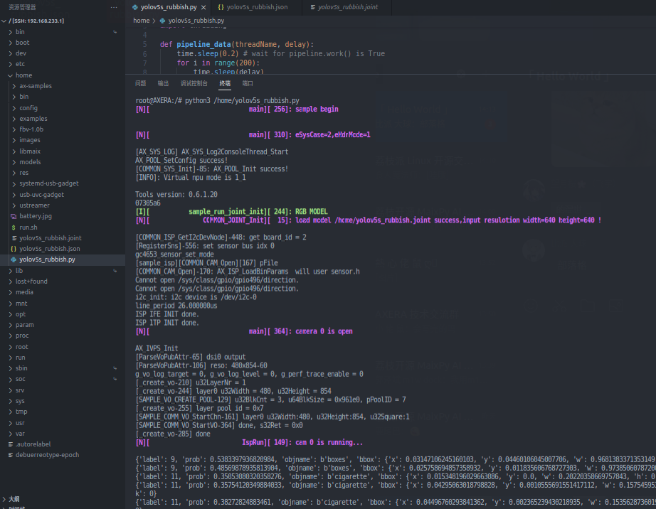

最后附一下 `yolov5s_out.gif` 实拍效果：（ 目前快速退出程序可以用 `CTRL + \` 比 `CTRL + C` 杀得快，零等待 XD ）


而这里不提及 C/C++ 是相对于零基础的同学来说过于复杂，在系统里已经提供了一些编译好的验证程序，所以 yolov5s 可以直接使用 `/home/bin/sample_vin_ivps_joint_vo -p /home/yolov5s_rubbish.json -c 2` 进行测试。

这与 python 代码的用法和效果是一样的，只是不会输出识别坐标到终端，仅供调试参考，添加业务逻辑请直接修改仓库的 C/C++ 源码，或通过 Python 调试。

想了解更多详细请查阅：[Maix-III AXera-Pi 系统基础使用 - Sipeed Wiki](https://wiki.sipeed.com/hardware/zh/maixIII/ax-pi/basic_usage.html#%E5%86%85%E7%BD%AE%E5%BC%80%E7%AE%B1%E5%BA%94%E7%94%A8)

最后用到的主要文件有如下：

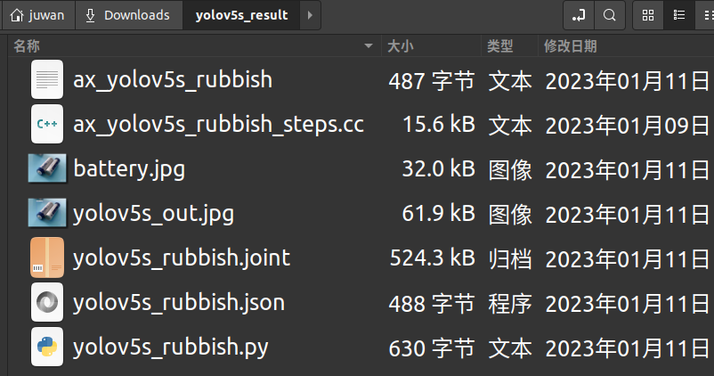
