</div>

<div align="center">

English | [简体中文](README_zh-CN.md)

</div>

# [m3axpi] YOLOv5 train and convert model guide
### Introduction
YOLOv5 is a 2D real-time object detection model, open sourced by <a href="https://ultralytics.com"> Ultralytics </a>on June 9, 2020. Including multiple models. For instance yolov5n, yolov5n6, yolov5s, yolov5s6, yolov5m, yolov5m6, yolov5l, yolov5l6, yolov5x, yolov5x6. YOLOv5 has many advantages. For instance fast training speed, little inference time, easy to train and deploy. The neural network structure of YOLOv5 can be divided into four parts intput, backbone, neck, head.


This tutorial explains the model training of YOLOv5 and deploy with Sipeed's development board m3axpi, Learn about the product at https://wiki.sipeed.com/en/m3axpi This is the actual shooting effect.

https://user-images.githubusercontent.com/32978053/216542487-0d17a9e4-ca81-4e67-a087-4ecf18b34feb.mp4

### 0. Get Started

First create a working directory, all the following operations are in this directory.

Right-click to open the terminal and execute the following command:
```bash
cd ~
mkdir m3axpi && cd m3axpi
```

### 1. Prepare dataset

How to make a object detection dataset, please refer to hyperlinks, This tutorial uses the marked "garbage detection" dataset to explain the whole process. This dataset can be obtained in the following three ways:

1. Download using browser

Github: https://github.com/Abandon-ht/coco_rubbish_dataset/archive/refs/heads/main.zip

Unzip the downloaded dataset to the datasets folder, and rename its folder to rubbish

2. Pull repository

```bash
mkdir datasets && cd datasets
git clone https://github.com/Abandon-ht/coco_rubbish_dataset.git rubbish
```
3. Download using command in terminal

```bash
mkdir datasets && cd datasets
wget https://github.com/Abandon-ht/coco_rubbish_dataset/archive/refs/heads/main.zip
unzip coco_rubbish_dataset-main.zip
mv coco_rubbish_dataset-main rubbish
```

All three methods can get the following 2 folders and 3 files

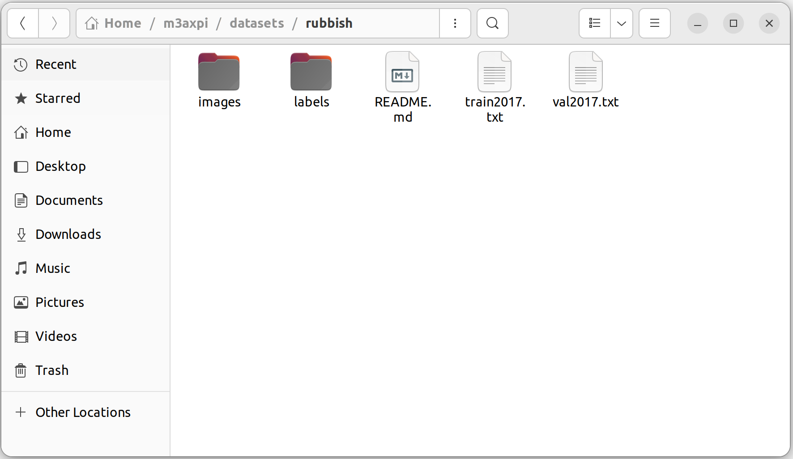

### 2. Pull the yolov5 repository

In the m3axpi directory (not in the datasets directory), pull the yolov5 repository

```bash
cd ~/m3axpi
git clone -b v7.0 https://github.com/ultralytics/yolov5.git  # clone
cd yolov5
pip install -r requirements.txt  # install
```

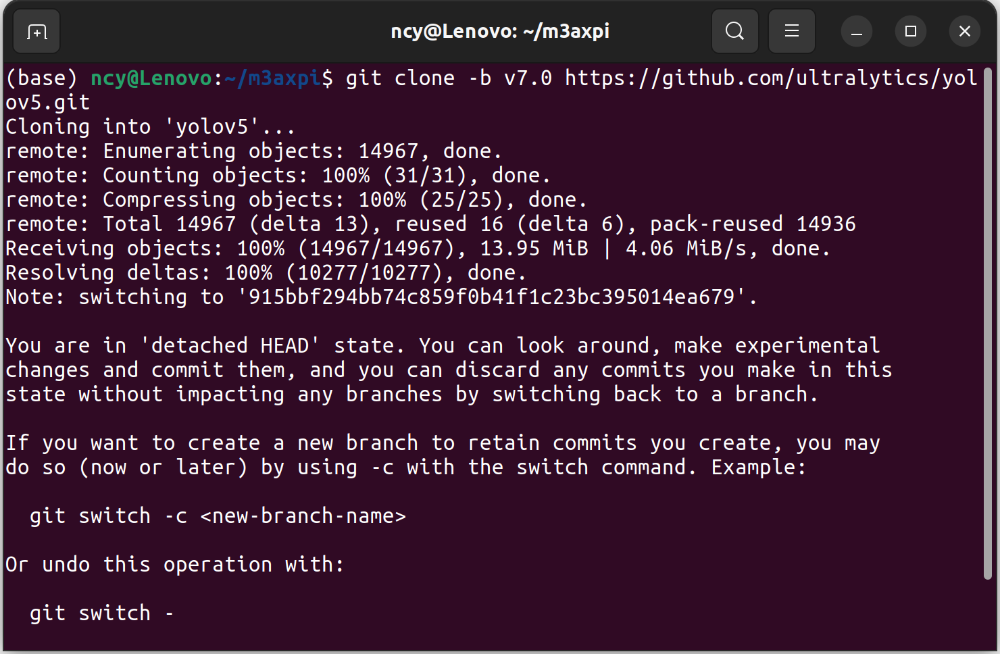

The yolov5 directory is shown in the picture:

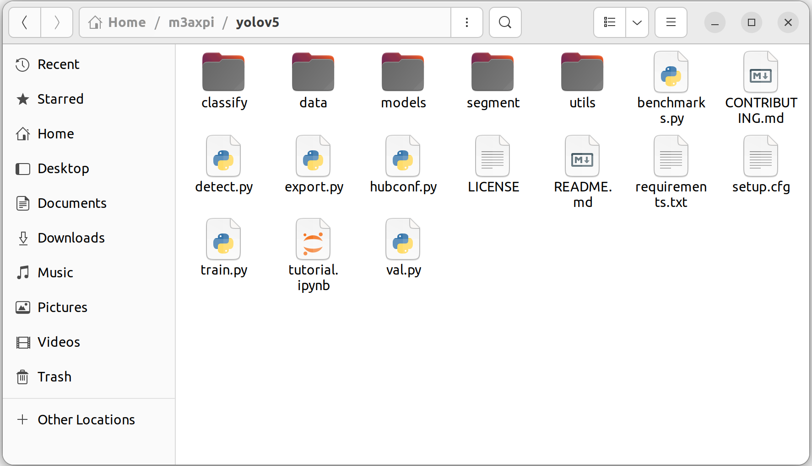

### 3. Train yolov5 models

Switch to the working directory of yolov5, copy coco.yaml under the data folderl, and rename it to rubbish.yaml

```bash
cp data/coco.yaml data/rubbish.yaml
```

Modify the path and classes name of the garbage classification dataset according to the picture

```bash
# Train/val/test sets as 1) dir: path/to/imgs, 2) file: path/to/imgs.txt, or 3) list: [path/to/imgs1, path/to/imgs2, ..]
path: ../datasets/rubbish  # dataset root dir
train: train2017.txt  # train images (relative to 'path') 118287 images
val: val2017.txt  # val images (relative to 'path') 5000 images
# test: test-dev2017.txt  # 20288 of 40670 images, submit to https://competitions.codalab.org/competitions/20794

# Classes
names:
  0: battery
  1: pills
  2: bananas
  3: apples
  4: cans
  5: bottles
  6: ceram
  7: green vegatable
  8: broccoli
  9: boxes
  10: glass
  11: cigarette
  12: orange
  13: eggshell
  14: spitball
  15: tile
```


After the modification, train the yolov5s model with the following command

```bash
python train.py --data data/rubbish.yaml --cfg models/yolov5s.yaml --weights yolov5s.pt --batch-size -1 --epoch 20
```

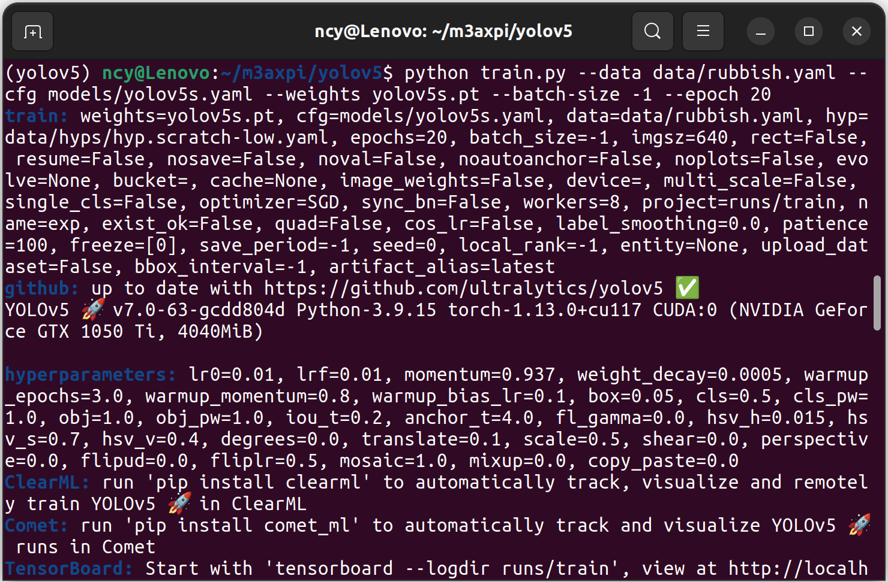

The dataset is loaded successfully and the model training starts. If not loaded successfully, please check the dataset path

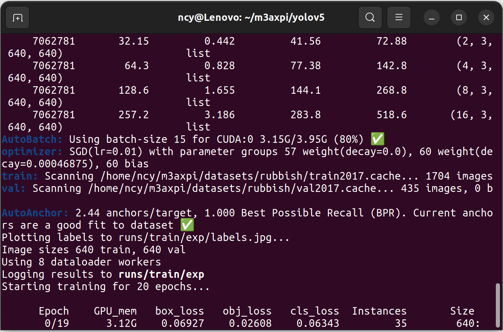

After the training is completed, you can view the training log under the ./runs/train/exp/ folder

PR_curve.png is the mAP_0.5 curve


results.png is all curves


### 4. Model Inference and Export

You can use the following command to predict the picture, note that you need to modify the path of the picture and the model to your own path

```bash
python detect.py --source ../datasets/rubbish/images/IMG_20210311_213716.jpg --weights ./runs/train/exp/weights/best.pt
```

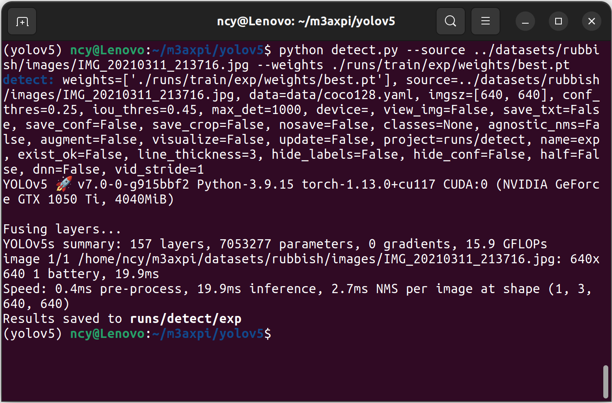

You can see the predicted images in the runs/detect/exp directory.

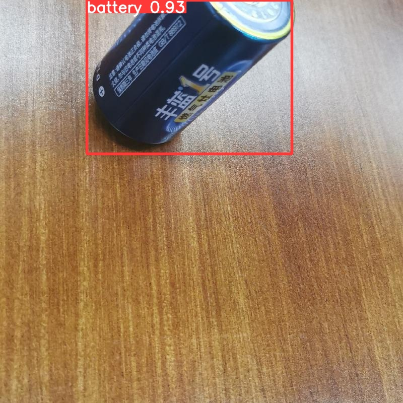

Modify the models/yolo.py file (class Detect(nn.Module):)

```python
    def forward(self, x):
        z = []  # inference output
        for i in range(self.nl):
            x[i] = self.m[i](x[i])  # conv
        #     bs, _, ny, nx = x[i].shape  # x(bs,255,20,20) to x(bs,3,20,20,85)
        #     x[i] = x[i].view(bs, self.na, self.no, ny, nx).permute(0, 1, 3, 4, 2).contiguous()
        # 
        #     if not self.training:  # inference
        #         if self.dynamic or self.grid[i].shape[2:4] != x[i].shape[2:4]:
        #             self.grid[i], self.anchor_grid[i] = self._make_grid(nx, ny, i)
        # 
        #         if isinstance(self, Segment):  # (boxes + masks)
        #             xy, wh, conf, mask = x[i].split((2, 2, self.nc + 1, self.no - self.nc - 5), 4)
        #             xy = (xy.sigmoid() * 2 + self.grid[i]) * self.stride[i]  # xy
        #             wh = (wh.sigmoid() * 2) ** 2 * self.anchor_grid[i]  # wh
        #             y = torch.cat((xy, wh, conf.sigmoid(), mask), 4)
        #         else:  # Detect (boxes only)
        #             xy, wh, conf = x[i].sigmoid().split((2, 2, self.nc + 1), 4)
        #             xy = (xy * 2 + self.grid[i]) * self.stride[i]  # xy
        #             wh = (wh * 2) ** 2 * self.anchor_grid[i]  # wh
        #             y = torch.cat((xy, wh, conf), 4)
        #         z.append(y.view(bs, self.na * nx * ny, self.no))
        # 
        # return x if self.training else (torch.cat(z, 1),) if self.export else (torch.cat(z, 1), x)
        return x
```

Modify the export.py file

```python
    # shape = tuple((y[0] if isinstance(y, tuple) else y).shape)  # model output shape
    metadata = {'stride': int(max(model.stride)), 'names': model.names}  # model metadata
    # LOGGER.info(f"\n{colorstr('PyTorch:')} starting from {file} with output shape {shape} ({file_size(file):.1f} MB)")
```

Use the following command to export the onnx model, pay attention to add the parameter opset=11

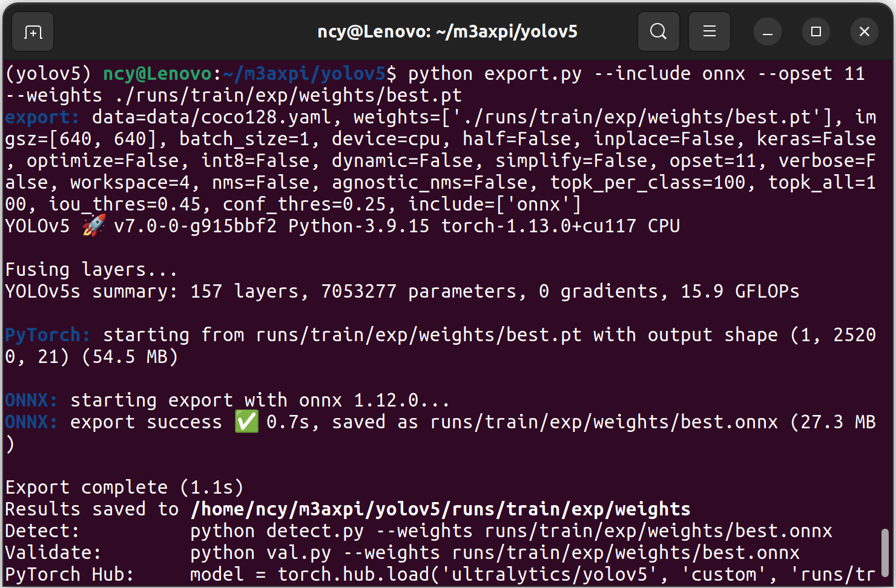

```bash
python export.py --include onnx --opset 11 --weights./runs/train/exp/weights/best.pt
```

The exported onnx model is in the runs/train/exp/weights directory

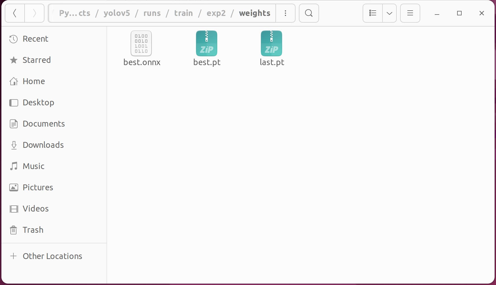

Enter netron.app in the browser address bar, Open the best.onnx file exported in the previous step, Check out the model structure of yolov5.

The input name of the model is 'images'

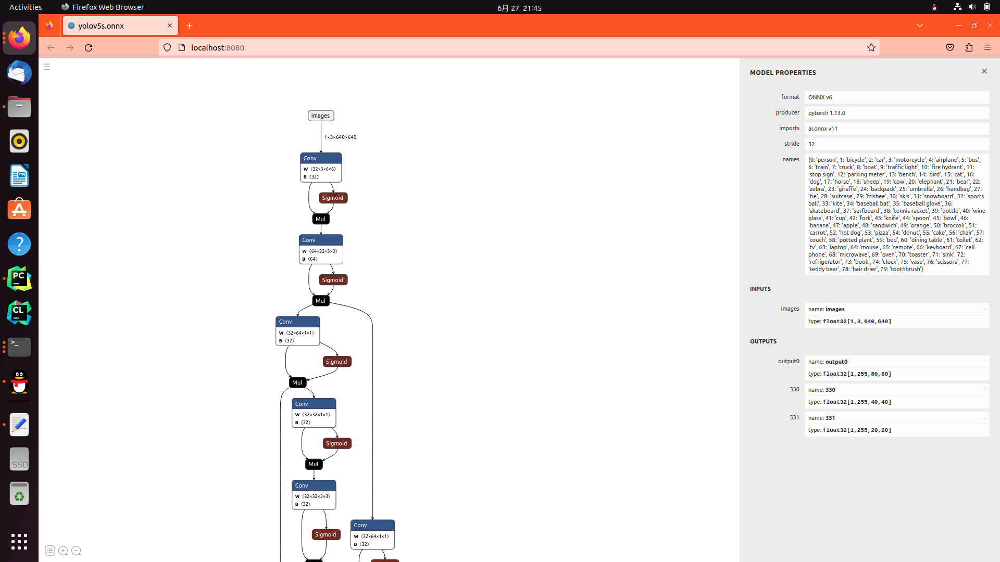

The output of the first Conv is output0 The output of the second Conv is 330 The output of the third Conv is 331

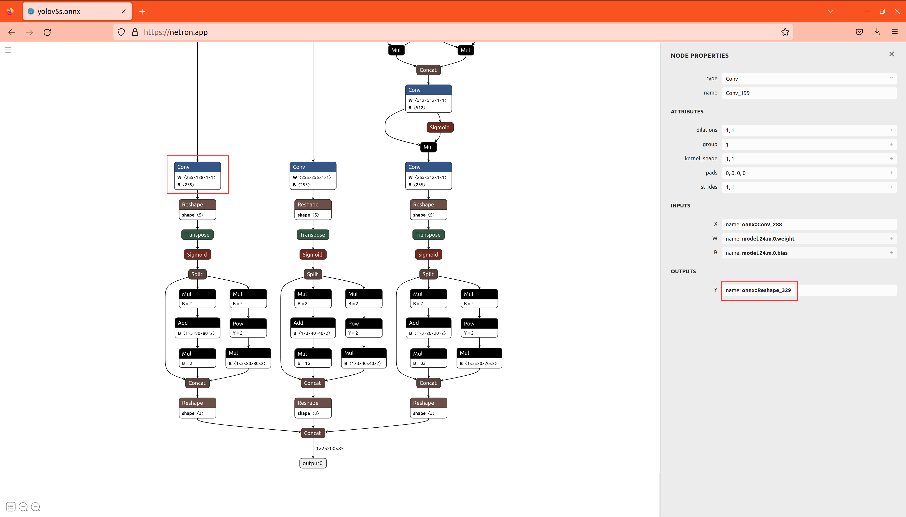

### 5. Pack training pictures

Enter the image directory of the dataset, use the following command to package the image as rubbish_1000.tar, note that the extension of the file is .tar

```bash
cd  ~/m3axpi/datasets/rubbish/images/
tar -cvf rubbish_1000.tar *.jpg
```


Create a dataset directory, and use the following command to move the compressed package rubbish_1000.tar to the ~/dataset directory

```bash
mkdir -p ~/m3axpi/dataset
mv ~/m3axpi/datasets/rubbish/images/rubbish_1000.tar ~/m3axpi/dataset
```


### 6. Create a model conversion environment

The onnx model needs to be converted to a joint model to run on m3axpi, so the pulsar model conversion tool needs to be used. Note that pb, tflite, weights, paddle and other models need to be converted to onnx models before using the pulsar model conversion tool

Use the following command to pull the container with the model conversion tool, if you have not installed docker, please install it first

```bash
docker pull sipeed/pulsar:0.6.1.20
```


Use the following command to enter the container. If you need to keep the container, please delete the '--rm' parameter. Be sure to set up shared memory and mount the m3axpi working directory to the 'data' directory of the container

```bash
cd ~/m3axpi
docker run -it --net host --rm --shm-size 16g -v $PWD:/data sipeed/pulsar
```


If you have an Nvidia GPU environment, you can use the following command to use a container with GPU to speed up the model conversion

```bash
cd ~/m3axpi
docker run -it --net host --rm --gpus all --shm-size 16g -v $PWD:/data sipeed/pulsar
```

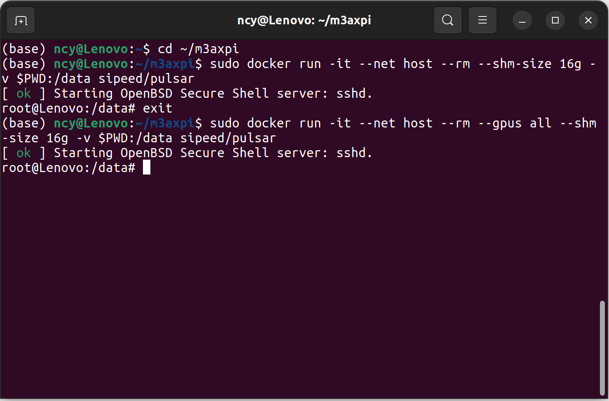

Create 'config' and 'onnx' folders in the working directory.

```bash
cd ~/m3axpi
mkdir config onnx
```
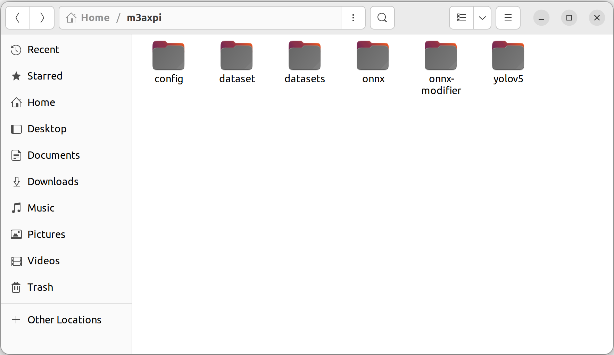

Create a file named yolov8s_rubbish.prototxt under config, copy the following content to the file, and pay attention to modify the path of rubbish_1000.tar in the file

```
# my_config.prototxt

# Basic configuration parameters: input and output
input_type: INPUT_TYPE_ONNX

output_type: OUTPUT_TYPE_JOINT

# Select the hardware platform
target_hardware: TARGET_HARDWARE_AX620

# CPU backend selection, default AX
cpu_backend_settings {
    onnx_setting {
        mode: DISABLED
    }
    axe_setting {
        mode: ENABLED
        axe_param {
            optimize_slim_model: true
        }
    }
}

# input
src_input_tensors {
    color_space: TENSOR_COLOR_SPACE_RGB
}

dst_input_tensors {
    color_space: TENSOR_COLOR_SPACE_RGB
}

# Configuration parameters for the neuwizard tool
neuwizard_conf {
    operator_conf {
        input_conf_items {
            attributes {
                input_modifications {
                    affine_preprocess {
                        slope: 1
                        slope_divisor: 255
                        bias: 0
                    }
                }
                # input_modifications {
                #     input_normalization {
                #         mean: [0,0,0]
                #         std: [0.5,0.5,0.5]
                #     }
                # }
            }
        }
    }
    dataset_conf_calibration {
        path: "/data/dataset/rubbish_1000.tar" # The tar package of the dataset image, used to calibrate the model during compilation
        type: DATASET_TYPE_TAR         # Dataset type: tar package
        size: 256                      # The actual number of data required for calibration during compilation is 256
    }
    dataset_conf_error_measurement {
        path: "/data/dataset/rubbish_1000.tar" # Used for bisection during compilation
        type: DATASET_TYPE_TAR
        size: 4                        # The actual number of data required for the bisection process is 4
        batch_size: 1
    }

}

dst_output_tensors {
    tensor_layout:NHWC
}

# Configuration parameters for pulsar compiler
pulsar_conf {
    ax620_virtual_npu: AX620_VIRTUAL_NPU_MODE_111
    batch_size: 1
    debug : false
}
```


Move the modified model file best_cut.onnx or modified_best.onnx to the onnx directory, and use the following command to convert the model: (note that the name of the modified model file is changed to your own model name)

```bash
pulsar build --input onnx/best_cut.onnx --output yolov5s_rubbish.joint --config config/yolov5s_rubbish.prototxt --output_config yolov5s_rubbish.prototxt
```
start converting


The conversion time is long, please wait patiently


conversion complete


The converted model yolov5s_rubbish.joint can be found in the working directory


### 7. Deployment

Please refer to https://github.com/AXERA-TECH/ax-samples/blob/main/README_EN.md
(to be continued)
